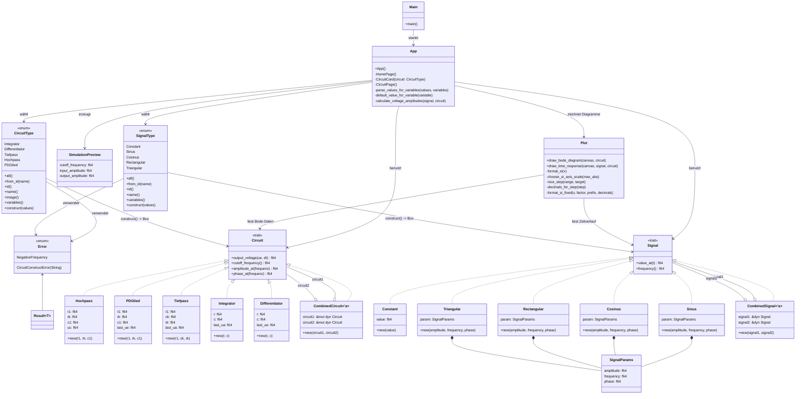

```mermaid
classDiagram
    direction TB

    class Main {
        +main()
    }

    class App {
        +App()
        -HomePage()
        -CircuitCard(circuit: CircuitType)
        -CircuitPage()
        -parse_values_for_variables(values, variables)
        -default_value_for_variable(variable)
        -calculate_voltage_amplitudes(signal, circuit)
    }

    class Plot {
        +draw_bode_diagram(canvas, circuit)
        +draw_time_response(canvas, signal, circuit)
        -format_si(v)
        -choose_si_axis_scale(max_abs)
        -nice_step(range, target)
        -decimals_for_step(step)
        -format_si_fixed(v, factor, prefix, decimals)
    }

    class SimulationPreview {
        cutoff_frequency: f64
        input_amplitude: f64
        output_amplitude: f64
    }

    class Error {
        <<enum>>
        NegativeFrequency
        CircuitConstructError(String)
    }

    class Result~T~

    class CircuitType {
        <<enum>>
        Integrator
        Differentiator
        Tiefpass
        Hochpass
        PDGlied
        +all()
        +from_id(name)
        +id()
        +name()
        +image()
        +variables()
        +construct(values)
    }

    class Circuit {
        <<trait>>
        +output_voltage(ue, dt) f64
        +cutoff_frequency() f64
        +amplitude_at(frequenz) f64
        +phase_at(frequenz) f64
    }

    class Hochpass {
        r1: f64
        rk: f64
        c1: f64
        uc: f64
        +new(r1, rk, c1)
    }

    class PDGlied {
        r1: f64
        rk: f64
        c1: f64
        last_ue: f64
        +new(r1, rk, c1)
    }

    class Tiefpass {
        r1: f64
        ck: f64
        rk: f64
        last_ua: f64
        +new(r1, ck, rk)
    }

    class Integrator {
        r: f64
        c: f64
        last_ua: f64
        +new(r, c)
    }

    class Differentiator {
        r: f64
        c: f64
        last_ue: f64
        +new(r, c)
    }

    class CombinedCircuit~'a~ {
        circuit1: &mut dyn Circuit
        circuit2: &mut dyn Circuit
        +new(circuit1, circuit2)
    }

    class SignalType {
        <<enum>>
        Constant
        Sinus
        Cosinus
        Rectangular
        Triangular
        +all()
        +from_id(name)
        +id()
        +name()
        +variables()
        +construct(values)
    }

    class Signal {
        <<trait>>
        +value_at(t) f64
        +frequency() f64
    }

    class SignalParams {
        amplitude: f64
        frequency: f64
        phase: f64
    }

    class Constant {
        value: f64
        +new(value)
    }

    class Sinus {
        param: SignalParams
        +new(amplitude, frequency, phase)
    }

    class Cosinus {
        param: SignalParams
        +new(amplitude, frequency, phase)
    }

    class Rectangular {
        param: SignalParams
        +new(amplitude, frequency, phase)
    }

    class Triangular {
        param: SignalParams
        +new(amplitude, frequency, phase)
    }

    class CombinedSignal~'a~ {
        signal1: &dyn Signal
        signal2: &dyn Signal
        +new(signal1, signal2)
    }

    Main --> App : startet
    App --> CircuitType : wählt
    App --> SignalType : wählt
    App --> Plot : zeichnet Diagramme
    App --> SimulationPreview : erzeugt
    App --> Circuit : benutzt
    App --> Signal : benutzt

    Plot --> Circuit : liest Bode-Daten
    Plot --> Signal : liest Zeitverlauf
    CircuitType --> Circuit : construct() -> Box<dyn Circuit>
    SignalType --> Signal : construct() -> Box<dyn Signal>

    Error <-- Result~T~
    CircuitType --> Error : verwendet
    SignalType --> Error : verwendet

    Circuit <|.. Hochpass
    Circuit <|.. PDGlied
    Circuit <|.. Tiefpass
    Circuit <|.. Integrator
    Circuit <|.. Differentiator
    Circuit <|.. CombinedCircuit

    Signal <|.. Constant
    Signal <|.. Sinus
    Signal <|.. Cosinus
    Signal <|.. Rectangular
    Signal <|.. Triangular
    Signal <|.. CombinedSignal

    CombinedCircuit o-- Circuit : circuit1
    CombinedCircuit o-- Circuit : circuit2

    Sinus *-- SignalParams
    Cosinus *-- SignalParams
    Rectangular *-- SignalParams
    Triangular *-- SignalParams

    CombinedSignal o-- Signal : signal1
    CombinedSignal o-- Signal : signal2
```
